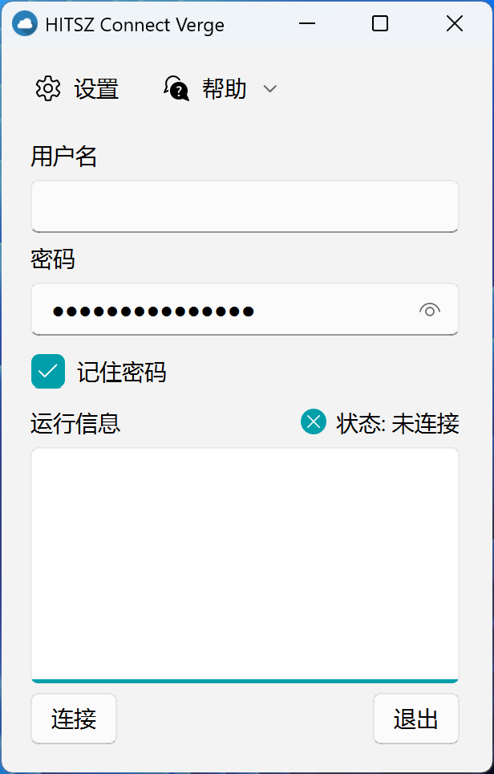
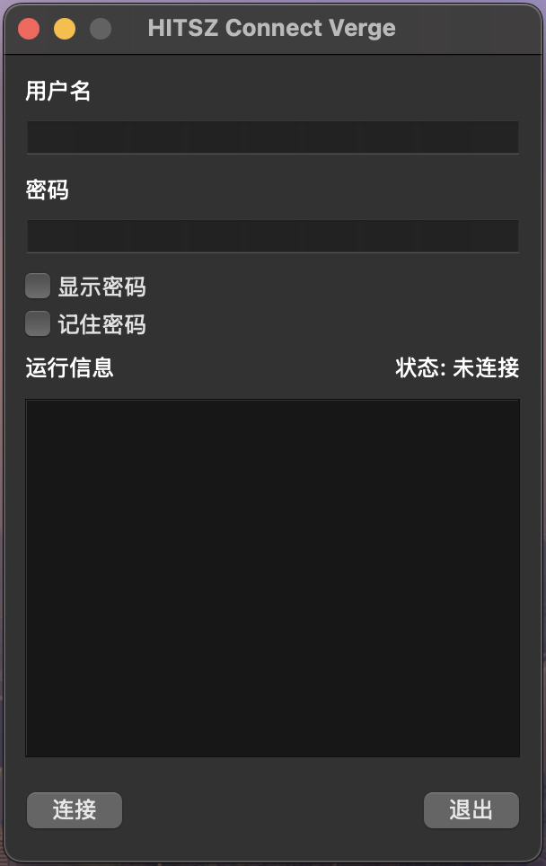
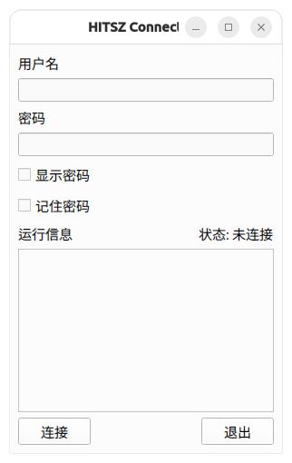

<div align="center">


# BITZH Connect

[English](README.md) | [中文](README.zh-CN.md)


</div>

> [!NOTE]
> This is an **unofficial** client for the BITZH campus VPN, maintained for **personal, small-scale use only**. It is not affiliated with or endorsed by Beijing Institute of Technology, Zhuhai.

## Introduction

BITZH Connect is a GUI of [ZJU Connect](https://github.com/Mythologyli/zju-connect), forked from [kowyo/hitsz-connect-verge](https://github.com/kowyo/hitsz-connect-verge) and adapted for the campus network of Beijing Institute of Technology, Zhuhai (BITZH). It works with ZJU Connect/EasyConnect-compatible (Sangfor) VPN servers.

## Features

- Fast and green compared to **EasyConnect**.
- Built with PySide6, easy to build and maintain.
- Multi-platform support, with native optimization for the **macOS** version.
- Works with other applications like Clash, Remote Desktop, and SSH. (See [Working with other applications](#working-with-other-applications))
- After a successful connection, the dashboard provides quick links to the e-library (电子图书馆) and the unified portal (统一门户).
- Supports custom server address/DNS/HTTP/SOCKS5 proxy port, and keep-alive settings. (If you need additional parameters, please submit an issue/PR)

## Installation

You can install BITZH Connect in two ways: downloading pre-built binaries or building from source.

> [!NOTE]
>
> 1. Username and password are the same as the ones you use to log in to the BITZH campus network (unified identity authentication).
> 2. If the download speed is slow, you can try using [gh-proxy](https://gh-proxy.com) to download.

### Method 1: Downloading pre-built binaries

BITZH Connect provides out-of-the-box experience. You can download the latest version from the [release page](https://github.com/GtJerry111/bitzh-connect/releases/latest).

> [!IMPORTANT]
> For macOS version, you need to grant access to the application by running:
>
> ```bash
> sudo xattr -rd com.apple.quarantine /Applications/BITZH\ Connect.app
> ```

### Method 2: Building from source

1. Clone the repository:

   ```bash
   git clone https://github.com/GtJerry111/bitzh-connect.git
   cd bitzh-connect
   ```

2. Install dependencies:
   - Install [uv](https://docs.astral.sh/uv/getting-started/installation/)

   - Sync the environment:

     ```bash
     uv sync
     ```

3. Run the application:

   macOS/Linux

   ```bash
   source .venv/bin/activate
   uv run app/main.py
   ```

   Windows (Powershell)

   ```powershell
   .\.venv\Scripts\activate.ps1
   uv run .\app\main.py
   ```

4. (Optional) Build the binaries:

   Please refer to our [GitHub Actions workflow](.github/workflows/release.yml) for more information.

## TUN Mode

By default (proxy mode), only traffic from applications configured to use the proxy goes through the VPN. To route all traffic (including raw TCP connections such as SSH) through the VPN, enable "TUN Mode (Global Routing)" in Advanced Settings -> Network.

> [!NOTE]
>
> 1. TUN mode requires administrator privileges: macOS may prompt for authorization (osascript) on every connect/disconnect, and Linux elevates via pkexec. Windows is not supported in this release.
> 2. TUN mode is mutually exclusive with Clash's TUN mode — only one of them can be enabled at a time.
> 3. In TUN mode the dashboard shows the real upload/download rates; in proxy mode the rates are shown as "—".

## Working with other applications

### Basic information

- **Server**: 112.91.150.228
- **SOCKS5 Proxy**: 1080
- **HTTP Proxy**: 1081
- **DNS Server**: automatically obtained from the server (auto DNS)

If you want to learn more about the network configuration, you can visit [Mythologyli/zju-connect](https://github.com/Mythologyli/zju-connect).

### Clash

If you want to use Clash at the same time (e.g. watching Youtube and visiting <http://jw.bitzh.edu.cn> at the same time), you can add the following configuration to your clash configuration file.

For example, if you are using [Clash Verge Rev](https://github.com/clash-verge-rev/clash-verge-rev), you can go to 'Profiles' -> Right click on the profile you are using -> 'Edit File' -> Add the following configuration:

```yaml
# note: do not append this to the end of the file directly, append it separately to the corresponding position
proxies:
  # your existing proxies...
  - { name: "BITZH Connect", type: socks5, server: 127.0.0.1, port: 1080, udp: true }

proxy-groups:
  # your existing proxy-groups...
  - { name: 校园网, type: select, proxies: ["DIRECT", "BITZH Connect"] }

rules:
  # your existing rules...
  - "IP-CIDR,112.91.150.228/32,DIRECT,no-resolve"
  - "DOMAIN-SUFFIX,bitzh.edu.cn,校园网"
  # on-campus resources also live under zhbit.com (e.g. the payment platform ejf.zhbit.com)
  - "DOMAIN-SUFFIX,zhbit.com,校园网"
  - "IP-CIDR,10.0.0.0/8,校园网,no-resolve"
  # - 'IP-CIDR,<other_ip>,校园网,no-resolve'
```

> [!NOTE]
>
> 1. You need to enable `TUN Mode` in Clash, and enable the `Auto Configure Proxy` option of this software.
> 2. You need to turn off the `Always use Default Bypass` option in the `System Proxy` settings, and add `localhost` to the `Proxy Bypass` fields
> 3. A useful [global extend script](./scripts/clash-utils.js) is provided if you want to avoid the automatic update of the profiles overwrite your custom rules.

<!-- > (Confusion) 3. There is no need to enable the `Auto Configure Proxy` feature of this software. In this case, Clash will host the system proxy and the proxy of this software will be forwarded by Clash. -->

[Learn more](https://oldkingok.cc/share/8bFQXBjOkXt8)

### Remote Desktop

If you want to connect to the remote desktop in the campus network, you can use [Parallels Client](https://www.parallels.com/hk/products/ras/capabilities/parallels-client/), and configure the local 1080 port as a proxy.

### SSH

If you want to use SSH, you can use the following command to establish a connection.

For macOS/Linux users:

```bash
ssh -o ProxyCommand="nc -X 5 -x 127.0.0.1:1080 %h %p" <root>@<server> -p <port>
```

If you connect frequently, you can also put the ProxyCommand into `~/.ssh/config` (in proxy mode, SSH traffic must be forwarded through the local SOCKS5 proxy):

```
Host <alias>
    HostName <server>
    User <username>
    Port <port>
    ProxyCommand nc -X 5 -x 127.0.0.1:1080 %h %p
```

Then simply run `ssh <alias>`.

For Windows users, you can use [ncat](https://nmap.org/download.html) to setup SOCKS 5 proxy. Run the following command after installing ncat:

```powershell
ssh -o "ProxyCommand=ncat --proxy 127.0.0.1:1080 --proxy-type socks5 %h %p" <root>@<server> -p <port>
```

[Learn more](https://hoa.moe/blog/using-hitsz-connect-verge-to-ssh-school-server/#windows)

## Screenshots

| Windows                                                    | Mac                                                | Linux                                                  |
| ---------------------------------------------------------- | -------------------------------------------------- | ------------------------------------------------------ |
|  |  |  |

## Contributing

Contributions are welcome! Feel free to open an issue or submit a pull request. For major changes, please open an issue first to discuss what you would like to change.

Also, any typo is welcome to be fixed.

## Related Projects

- [chenx-dust/HITsz-Connect-for-Windows](https://github.com/chenx-dust/HITsz-Connect-for-Windows): HITsz Edition of ZJU-Connect-for-Windows. Support advanced settings and multi-platform.
- [Co-ding-Man/hitsz-connect-for-windows](https://github.com/Co-ding-Man/hitsz-connect-for-windows): Out-of-the-box zju-connect simple GUI for Windows, suitable for HITSZ.

## Credits

- [kowyo](https://github.com/kowyo) for the upstream project [hitsz-connect-verge](https://github.com/kowyo/hitsz-connect-verge), on which this fork is based.

- [Mythologyli](https://github.com/Mythologyli) for the project [ZJU Connect](https://github.com/Mythologyli/zju-connect).

- [Keldos](https://github.com/Keldos-Li) for designing the upstream macOS version's icon.

- [EasierConnect](https://github.com/lyc8503/EasierConnect).

- All the contributors to the upstream project.
